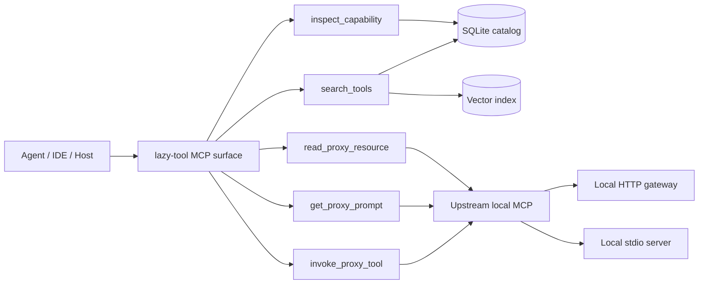
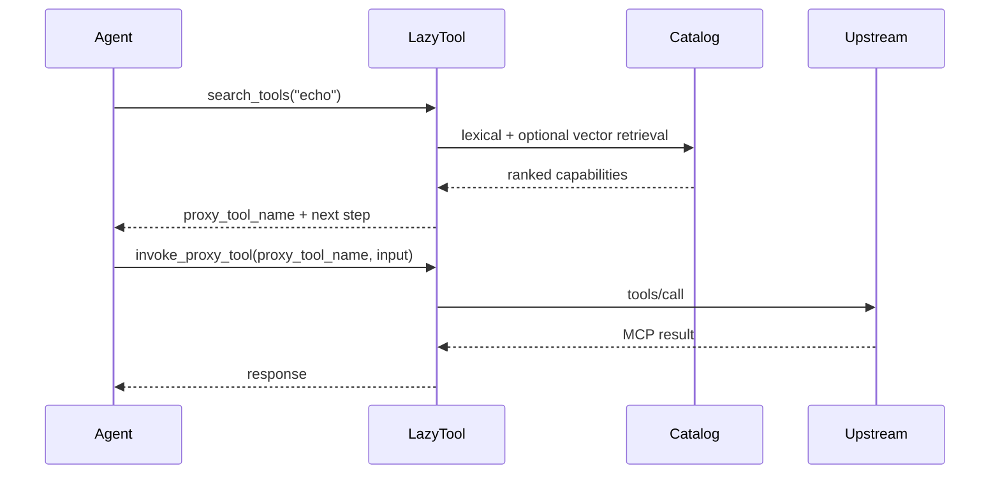
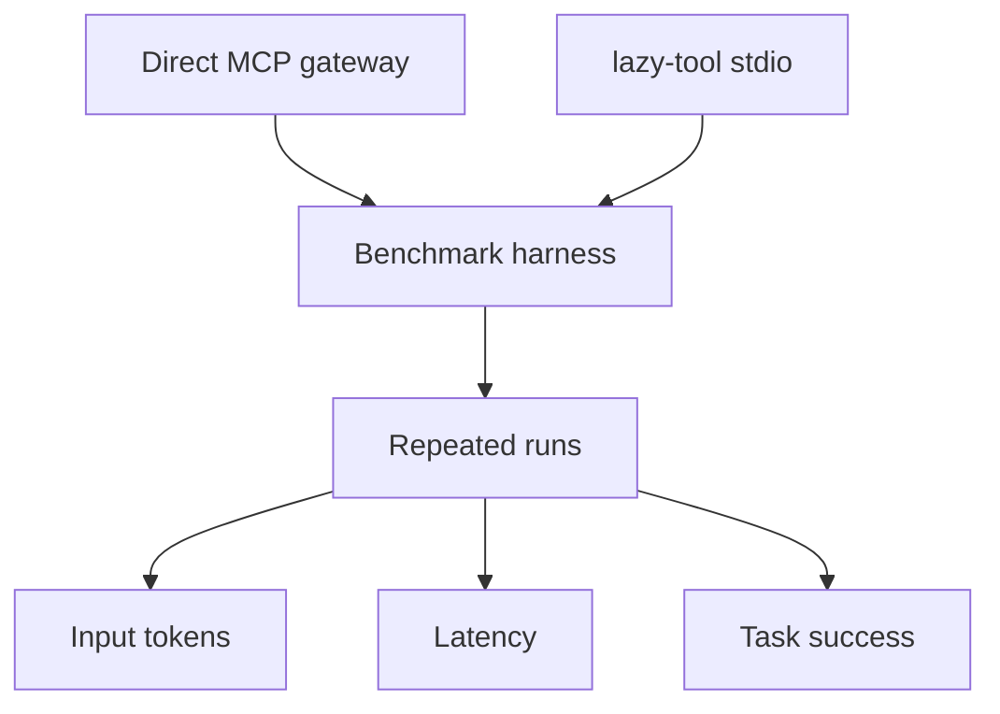
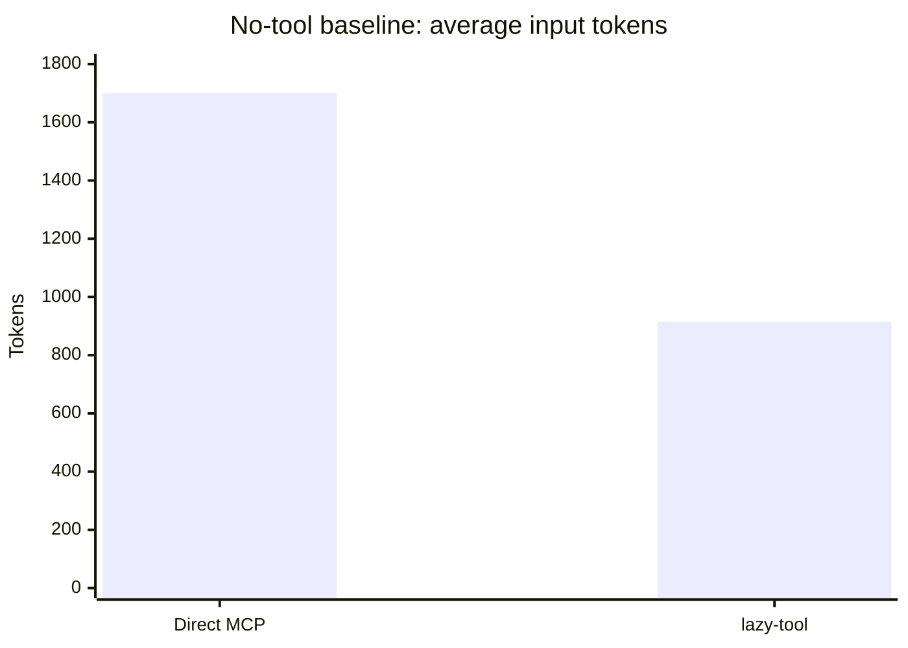
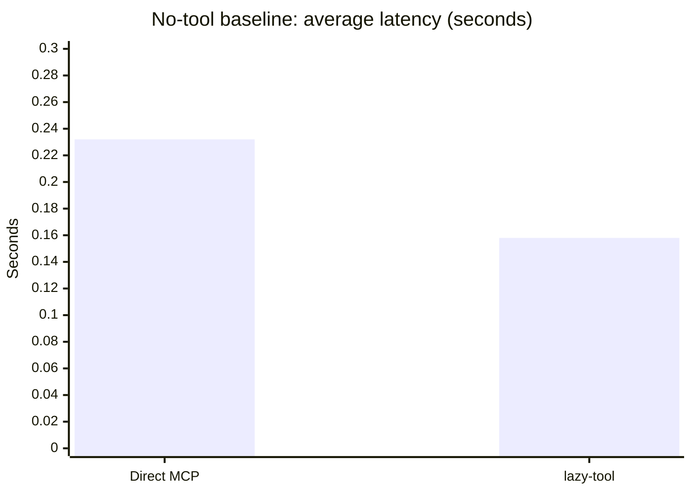
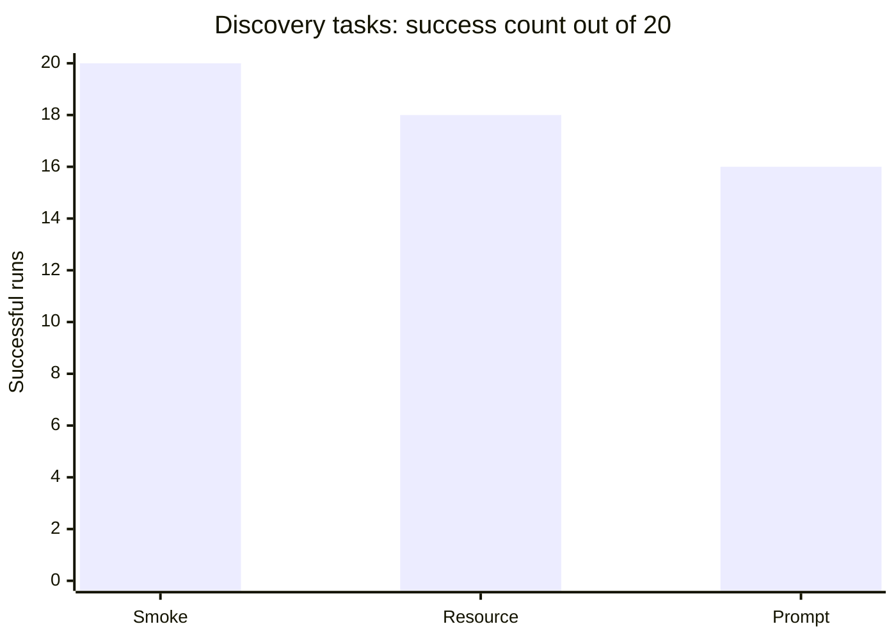
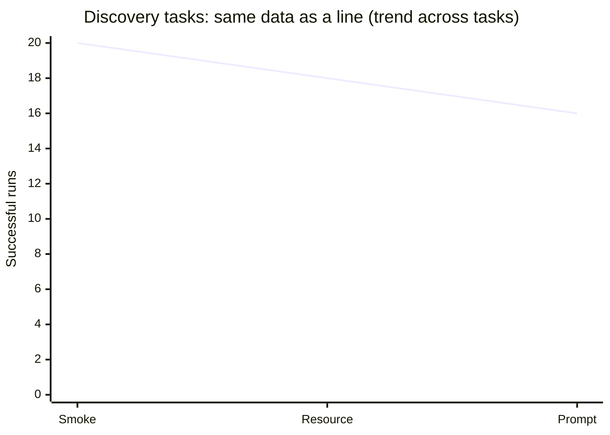

# lazy-tool

> **A local-first MCP discovery runtime that reduces prompt bloat and helps agents search before they invoke.**

[](https://github.com/rpgeeganage/lazy-tool/actions/workflows/ci.yml)

## Table of contents

- [What this project is](#what-this-project-is)
- [Why it exists](#why-it-exists)
- [What makes it different](#what-makes-it-different)
- [What it is not](#what-it-is-not)
- [How it works](#how-it-works)
- [Architecture](#architecture)
- [Quick start](#quick-start)
- [Web UI access](#web-ui-access)
- [MCP surface exposed to agents](#mcp-surface-exposed-to-agents)
- [Benchmark highlights](#benchmark-highlights)
- [Benchmark visuals](#benchmark-visuals)
- [Where lazy-tool is already strong](#where-lazy-tool-is-already-strong)
- [Current limitations](#current-limitations)
- [Use cases](#use-cases)
- [Documentation map](#documentation-map)
- [Project status](#project-status)
- [Contributing](#contributing)
- [Security](#security)
- [License](#license)

## What this project is

`lazy-tool` is a **local-first, local-only MCP discovery runtime** for developers and agent builders.

It sits in front of the MCP servers and MCP gateways you already run locally and gives agents a smaller, cleaner workflow:

1. **search** the local capability catalog
2. **inspect** a capability if needed
3. **invoke only the selected capability**

That means the model does **not** need the full upstream tool catalog in context up front.

## Why it exists

Raw MCP exposure does not scale well once local tool catalogs get large.

The pain usually shows up as:

- prompt bloat from large tool lists and schemas
- weaker models choosing the wrong tool or wrapper
- noisy local MCP sprawl across several servers or gateways
- poor portability across model providers and runtimes

`lazy-tool` exists to solve that with a **small, stable MCP surface** and a **local searchable catalog**.

## What makes it different

The core idea is simple:

> **Do not give the model the whole MCP universe. Give it discovery first, then route to the real capability only when needed.**

That makes `lazy-tool` closer to a **capability control layer** than a simple proxy.

Key characteristics:

- **local-first** — SQLite, local vector index, local process model
- **provider-agnostic** — not tied to one vendor’s tool-search feature
- **MCP-native** — it works with MCP servers and gateways you already use
- **search-before-invoke** — smaller prompt surface, cleaner runtime behavior
- **inspectable** — source health, inspect surfaces, explainable retrieval paths

## What it is not

`lazy-tool` is **not**:

- a hosted SaaS
- an enterprise control plane
- a multi-tenant MCP registry
- a Kubernetes or operator project
- a replacement for upstream MCP servers
- a promise that all tool-use reliability problems are solved

The scope is intentionally narrower:

**make local MCP ecosystems easier for agents to use.**

## How it works

At a high level:

1. You configure local HTTP MCP endpoints and or local stdio MCP servers under `sources:`
2. `lazy-tool reindex` fetches tools, prompts, resources, and templates
3. The catalog is stored locally in SQLite, with optional vector retrieval support
4. Agents talk only to `lazy-tool`'s small MCP surface
5. `lazy-tool` resolves and proxies the real upstream call only after capability selection

## Architecture



### Runtime flow



## Quick start

### 1. Build

```bash
make build
```

### 2. Configure local sources

Start from `configs/example.yaml` and point `sources:` at MCP servers or gateways you already run.

### 3. Reindex

```bash
export LAZY_TOOL_CONFIG=$PWD/configs/example.yaml
./bin/lazy-tool reindex
./bin/lazy-tool sources --status
```

### 4. Search the catalog

```bash
./bin/lazy-tool search "echo" --limit 5
./bin/lazy-tool search "prompt" --limit 5
./bin/lazy-tool search "resource" --limit 5
```

### 5. Run as an MCP server

```bash
./bin/lazy-tool serve
```

### 6. Optional local UIs

```bash
./bin/lazy-tool web --addr 127.0.0.1:8765
./bin/lazy-tool tui
```

When the Web UI starts, `lazy-tool` should print the local URL so users can open it immediately in a browser.

## Web UI access

The Web UI is **accessible by default on localhost only**:

```text
http://127.0.0.1:8765
```

- **default:** safe local access for the end user
- **not default:** network exposure

If you explicitly want LAN access, you can override the bind address:

```bash
./bin/lazy-tool web --addr 0.0.0.0:8765
```

For a local-first tool, `127.0.0.1` is the correct default.

## MCP surface exposed to agents

The public MCP surface should stay intentionally small.

Current agent-facing tools:

- `search_tools`
- `inspect_capability`
- `invoke_proxy_tool`
- `get_proxy_prompt`
- `read_proxy_resource`

That small surface is part of the product value.

## Benchmark highlights

These are the current **headline** numbers worth publishing from the clean local benchmark suite.

**Snapshot**
- **Date:** 2026-03-29
- **Model:** `llama-3.1-8b-instant`
- **Repeats per task:** 20
- **Mode:** direct MCPJungle vs `lazy-tool` stdio wrapper

### Baseline: no-tool turn

| Scenario | Avg input tokens | Avg latency |
|---|---:|---:|
| Direct MCP gateway | 1701 | 0.232s |
| `lazy-tool` stdio | 915 | 0.158s |

**Result**
- **46.2% lower input tokens**
- **31.9% lower average latency**

### Discovery/search tasks

| Task | Mode | Result |
|---|---|---:|
| `search_tools_smoke` | lazy-only | 20/20 |
| `search_tools_resource` | lazy-only | 18/20 |
| `search_tools_prompt` | lazy-only | 16/20 |

### Benchmark interpretation

These numbers support a narrow, honest claim:

> `lazy-tool` can materially reduce prompt overhead on no-tool turns while providing a working discovery surface for local MCP catalogs.

They do **not** mean:
- all end-to-end tool invocation is fully reliable
- all smaller models behave well on every task
- the project is finished

For the full benchmark methodology, reproducibility steps, and publishing rules, see [benchmark/README.md](benchmark/README.md).

**Visuals:** bar and line charts for these numbers live under [Benchmark visuals](#benchmark-visuals) (Mermaid on GitHub). For Chart.js in the browser, open [docs/benchmark-charts.html](docs/benchmark-charts.html) locally (same data; tables here stay canonical).

## Benchmark visuals

### What the benchmark measures



### Token reduction on a no-tool turn



### Latency comparison on a no-tool turn



### Discovery task reliability snapshot





**Interactive charts (bar + line in the browser):** open [docs/benchmark-charts.html](docs/benchmark-charts.html) locally (double-click or `open docs/benchmark-charts.html`).

These charts are visual summaries only. The tables above remain the source of truth for precise benchmark claims.

## Where lazy-tool is already strong

Today the repo is strongest in these areas:

- reducing token overhead when no tool is needed
- local discovery over larger MCP catalogs
- clear local-only positioning
- source-health visibility after reindex
- inspect and debug surfaces
- benchmark and CI discipline

## Current limitations

This project is honest about where it is still rough.

Current limitations include:

- wrapper and tool choice can still be model-sensitive on routed tasks
- some end-to-end lazy invocation paths are not README-grade yet
- search tuning is still evolving
- the configuration surface needs discipline to avoid knob creep
- local reliability is improving, but not solved forever

That honesty is important. Overclaiming kills trust.

## Use cases

`lazy-tool` is a good fit when you have:

- multiple local MCP servers or a large local MCP gateway
- weaker or cheaper models that struggle with large tool surfaces
- a need to reduce prompt bloat
- a local development workflow where you want discovery and routing separated
- a desire for a smaller, more inspectable MCP interface

## Documentation map

- **Setup, positioning, benchmark highlights:** this file
- **Benchmark charts (Mermaid + optional interactive HTML):** [Benchmark visuals](#benchmark-visuals) · [docs/benchmark-charts.html](docs/benchmark-charts.html)
- **Full benchmark methodology and publishing rules:** [benchmark/README.md](benchmark/README.md)
- **Plugging existing MCPs into lazy-tool:** [docs/plugging-existing-mcps.md](docs/plugging-existing-mcps.md)
- **Documentation hub:** [docs/README.md](docs/README.md)
- **Local MCPJungle helpers:** [benchmark/mcpjungle-dev/README.md](benchmark/mcpjungle-dev/README.md)

## Project status

This project is **past the toy stage**, but still actively hardening.

Current repository shape includes:

- Go CLI
- MCP stdio server
- SQLite catalog
- optional vector index
- Web UI
- TUI
- benchmark harness
- source health and inspect surfaces
- CI checks for code and benchmark artifacts

That means the repo is useful today, but still improving.

## Contributing

Contributions are welcome, especially around:

- runtime hardening
- search explainability and discipline
- benchmark realism
- documentation quality
- local integration ergonomics

Start here: [CONTRIBUTING.md](CONTRIBUTING.md)

## Security

If you find a security issue, please do **not** open a public exploit issue first.

See: [SECURITY.md](SECURITY.md)

## License

Add or link your project license here once finalized.
