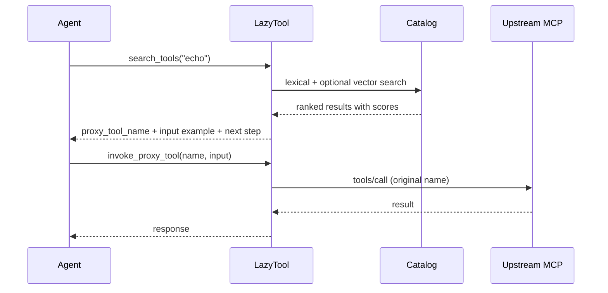
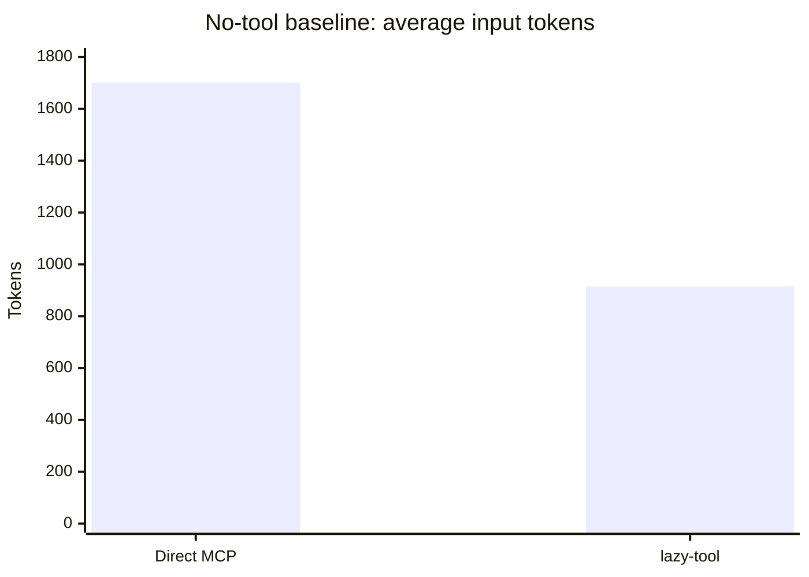
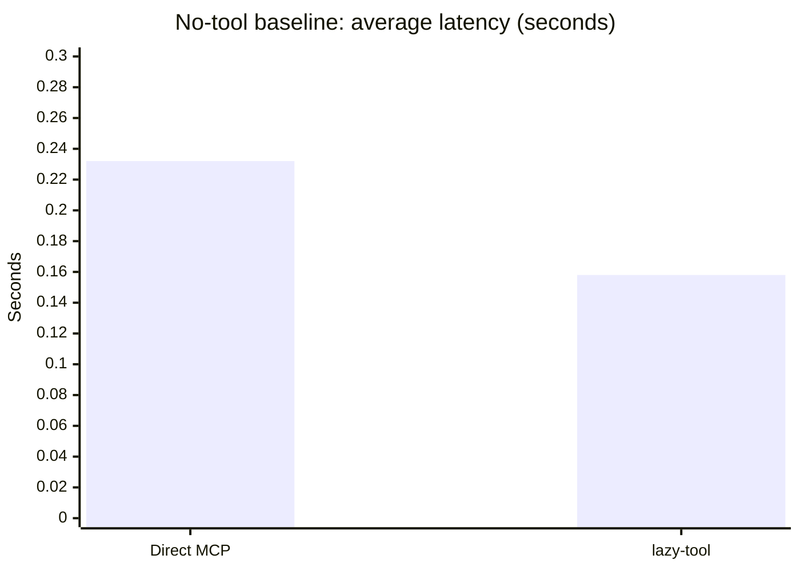

# lazy-tool

The more MCP servers you connect, the more tool schemas get dumped into every prompt. The model reads all of them, picks the wrong one more often, and you pay for every token. This is a [known problem](https://arxiv.org/abs/2505.03275) — the pattern that solves it (search before invoke) is well-established.

Most implementations of that pattern require a Python stack, a vector database, Docker, or a cloud service. `lazy-tool` does it as a single Go binary with a local SQLite catalog. No containers, no API keys for the tool layer, no infrastructure.

```
make build → import --write → reindex → serve
```

That's it. One binary, reads your existing IDE config, indexes everything locally, serves as an MCP endpoint.

| | Direct MCP | Through lazy-tool |
|---|---:|---:|
| Input tokens per turn | 1,701 | 915 **(−46%)** |
| Latency per turn | 0.232s | 0.158s **(−32%)** |
| Tools in agent context | 47 | 5 |

<sup>llama-3.1-8b-instant, 20 repeats per task. <a href="benchmark/README.md">Methodology</a></sup>

[](https://github.com/rpgeeganage/lazy-tool/actions/workflows/ci.yml)
[](LICENSE)
[](https://go.dev)

---

## Where it fits

Several projects address MCP tool sprawl in different ways: [RAG-MCP](https://github.com/fintools-ai/rag-mcp) (Python + vector DB), [MetaMCP](https://github.com/metatool-ai/metamcp) (Docker), [AWS AgentCore Gateway](https://aws.amazon.com/blogs/machine-learning/transform-your-mcp-architecture-unite-mcp-servers-through-agentcore-gateway/) (managed cloud), and Claude Code's [built-in tool search](https://modelcontextprotocol.io/specification/2025-06-18/server/tools) (client-side, Claude-only).

`lazy-tool` occupies a specific niche: local-first, zero-dependency, single binary.

- **No infrastructure.** One Go binary, local SQLite. No Docker, no vector DB service, no cloud account.
- **IDE auto-import.** Reads your Claude Desktop, Cursor, or VS Code MCP config. No manual YAML unless you want it.
- **Three modes in one tool.** Direct mode (transparent proxy) for simple setups and smaller models, search mode (5 meta-tools) for large catalogs with strong models, hybrid for both. Switch with a flag.
- **Provider-agnostic.** Not tied to Anthropic, OpenAI, or any specific client. Anything that speaks MCP over stdio or HTTP.
- **Reliability built in.** Circuit breaking, caching, session reuse, and tracing handled at the proxy layer.

If you're already inside Claude Code and only use Claude, the built-in tool search may cover your needs. If you want something that works across providers, runs locally without dependencies, and aggregates multiple MCP servers — that's the space `lazy-tool` is in.

---

## Install

### Quick install (pre-built binary)

```bash
curl -sSfL https://raw.githubusercontent.com/rpgeeganage/lazy-tool/main/install.sh | sh
```

Override the install directory (default `./bin`):

```bash
curl -sSfL https://raw.githubusercontent.com/rpgeeganage/lazy-tool/main/install.sh | INSTALL_DIR=/usr/local/bin sh
```

### Go install

```bash
go install github.com/rpgeeganage/lazy-tool/cmd/lazy-tool@latest
```

### Build from source

Requires Go 1.25+.

```bash
make build            # development build → bin/lazy-tool
make build-release    # optimized, stripped, version-stamped
```

---

## Get started

If you already have MCP servers in Claude Desktop, Cursor, or VS Code:

```bash
./lazy-tool import --write   # reads your IDE config, generates lazy-tool config
./lazy-tool reindex          # indexes every tool, prompt, and resource
./lazy-tool serve            # agent connects here instead of directly to MCP servers
```

Point your agent at `lazy-tool serve`. It searches for tools instead of receiving them all in context.

No IDE config? Write a YAML file manually — see [Configuration](#configuration).

---

## When to use which mode

- **Direct mode** — every cataloged tool is exposed by name. The agent sees real schemas, lazy-tool routes transparently. Best for smaller/cheaper models (Haiku, GPT-4.1-mini, local Ollama) that struggle with multi-step reasoning. They get a simple tool list and call tools directly — one step, no search overhead. Also good for strong models that benefit from single-endpoint aggregation, circuit breaking, and caching.

- **Search mode** (default) — the agent sees 5 meta-tools and discovers capabilities through search. Best for strong models (Claude, GPT-4, Llama 70B+) working with large tool catalogs (50+ tools) where dumping every schema into context wastes tokens and degrades selection accuracy. Requires the model to handle a two-step search→invoke pattern.

- **Hybrid mode** — both search and direct tools available. Useful for gradual migration or mixed workloads.

```bash
lazy-tool serve                  # search (default)
lazy-tool serve --mode direct    # direct
lazy-tool serve --mode hybrid    # both
```

---

## How it works

```
1. You configure MCP sources (or auto-import from your IDE)
2. lazy-tool reindex fetches every tool, prompt, and resource
3. The catalog is stored locally in SQLite with full-text search
4. Agents connect to lazy-tool via stdio or HTTP
5. The agent searches → finds → invokes — lazy-tool proxies to the real upstream
```



The agent sees 5 tools regardless of how many exist upstream:

| Tool | Purpose |
|---|---|
| `search_tools` | Find capabilities by keyword or description |
| `inspect_capability` | Get full schema before calling |
| `invoke_proxy_tool` | Call an upstream tool through the proxy |
| `get_proxy_prompt` | Fetch an upstream prompt |
| `read_proxy_resource` | Read an upstream resource |

---

## Reference

<details>
<summary><strong>Table of contents</strong> (click to expand)</summary>

- [Install](#install)
- [Detailed setup](#detailed-setup)
- [Auto-import from IDE configs](#auto-import-from-ide-configs)
- [CLI reference](#cli-reference)
- [Configuration](#configuration)
- [Search algorithm](#search-algorithm)
- [Reliability features](#reliability-features)
- [Response cache](#response-cache)
- [Web UI and TUI](#web-ui-and-tui)
- [Benchmarks](#benchmarks)
- [Current limitations](#current-limitations)
- [Documentation map](#documentation-map)
- [Contributing](#contributing)

</details>

---

## Detailed setup

### Prerequisites

- Go 1.25+
- At least one local MCP server or gateway running

### 1. Build

```bash
make build
# or: go build -o bin/lazy-tool ./cmd/lazy-tool
```

### 2. Configure

**Option A: Auto-import from your IDE** (recommended)

```bash
# Discovers MCP servers from Claude Desktop, Cursor, and VS Code
./bin/lazy-tool import --write
export LAZY_TOOL_CONFIG=~/.lazy-tool/config.yaml
```

**Option B: Write config manually**

```bash
cp configs/example.yaml my-config.yaml
export LAZY_TOOL_CONFIG=$PWD/my-config.yaml
```

Minimal config:

```yaml
app:
  name: my-tools

storage:
  sqlite_path: ./data/lazy-tool.db

sources:
  - id: my-gateway
    type: gateway
    transport: http
    url: http://localhost:8811/mcp

  - id: my-stdio-server
    type: server
    transport: stdio
    command: npx
    args: ["-y", "@your-scope/your-server"]
    env:
      API_KEY: "your-key"
```

### 3. Index the catalog

```bash
./bin/lazy-tool reindex
./bin/lazy-tool sources --status
```

### 4. Search

```bash
./bin/lazy-tool search "echo" --limit 5
./bin/lazy-tool search "file management" --explain-scores
```

### 5. Serve as MCP

```bash
# Search mode (default): 5 meta-tools, search-first workflow
./bin/lazy-tool serve

# Direct mode: all cataloged tools exposed as first-class MCP tools
./bin/lazy-tool serve --mode direct

# HTTP transport: serve over HTTP instead of stdio
./bin/lazy-tool serve --mode direct --transport http --addr :8080
```

Point your agent or IDE at `lazy-tool serve` as an MCP server. In HTTP mode, connect Claude Desktop to `http://localhost:8080/mcp`.

### 6. Optional UIs

```bash
./bin/lazy-tool web --addr 127.0.0.1:8765   # browser UI
./bin/lazy-tool tui                           # terminal UI
```

---

## Auto-import from IDE configs

`lazy-tool` can automatically discover MCP server configurations from Claude Desktop, Cursor, and VS Code — no manual YAML writing needed.

```bash
# Preview what would be imported (prints YAML to stdout)
lazy-tool import

# Import from a specific IDE
lazy-tool import --from claude
lazy-tool import --from cursor
lazy-tool import --from vscode

# Write config directly
lazy-tool import --write
lazy-tool import --write --output my-config.yaml
```

Supported config file locations:
- **Claude Desktop**: `~/Library/Application Support/Claude/claude_desktop_config.json` (macOS), `%APPDATA%\Claude\claude_desktop_config.json` (Windows)
- **Cursor**: `~/.cursor/mcp.json`
- **VS Code**: `~/.vscode/mcp.json`

---

## CLI reference

| Command | Description |
|---|---|
| `serve` | Run as MCP server (stdio or HTTP) with mode selection |
| `search <query>` | Search the catalog from CLI (JSON output) |
| `reindex` | Fetch upstream capabilities and rebuild the local catalog |
| `inspect <proxy_tool_name>` | Show full details for one indexed capability |
| `import` | Auto-discover MCP servers from Claude Desktop, Cursor, VS Code |
| `health` | Verify config and report basic status |
| `sources` | List configured MCP sources |
| `web` | Launch the browser-based UI |
| `tui` | Launch the interactive terminal UI |
| `pin add\|remove\|list` | Manage favorite capabilities (boosted in search) |
| `catalog export\|import\|set-summary` | Catalog management and manual summary overrides |
| `cache-clear` | Clear the response cache |
| `version` | Print version and git commit |

All commands accept `--config <path>` or read from `LAZY_TOOL_CONFIG`.

---

## Configuration

Full reference in [`configs/example.yaml`](configs/example.yaml). Key sections:

### Sources

```yaml
sources:
  - id: my-http               # unique identifier (required)
    type: gateway              # gateway | server
    transport: http            # http | stdio
    url: http://127.0.0.1:8811/mcp

  - id: my-stdio
    type: server
    transport: stdio
    command: npx
    args: ["-y", "@scope/server"]
    cwd: /path/to/project      # optional working directory
    env:                        # optional env vars for stdio process
      API_KEY: "your-key"
      NODE_ENV: "production"

  - id: disabled-source
    type: gateway
    transport: http
    url: http://127.0.0.1:9000/mcp
    disabled: true              # excluded from indexing and proxy

  - id: fallback-source
    type: gateway
    transport: http
    url: http://127.0.0.1:9001/mcp
    fallback: passthrough       # returns full catalog when search has zero results
```

### Storage

```yaml
storage:
  sqlite_path: ./data/lazy-tool.db    # required
  vector_path: ./data/vector          # optional (defaults to {sqlite_dir}/vector)
  history_path: ./data/history.log    # optional: append-only search query log
```

### Connectors (reliability)

```yaml
connectors:
  http_reuse_upstream_session: true     # reuse one HTTP session per source
  http_reuse_idle_timeout_seconds: 300  # close idle sessions after 5 min
  circuit_breaker_max_failures: 3       # trip after 3 consecutive failures (0 = disabled)
  circuit_breaker_cooldown_seconds: 30  # cooldown before half-open probe
```

### Embeddings (optional semantic search)

```yaml
embeddings:
  provider: ollama                     # noop | ollama | openai-compatible
  model: nomic-embed-text
  base_url: http://127.0.0.1:11434
```

### Summarization (optional LLM descriptions)

```yaml
summary:
  provider: openai-compatible
  model: gpt-4.1-mini
  enabled: true
  base_url: https://api.openai.com/v1
  api_key_env: OPENAI_API_KEY
```

### Server

```yaml
server:
  mcp:
    transport: stdio            # stdio | http
    mode: search                # search | direct | hybrid
    host: ""                    # for HTTP transport
    port: 8080                  # for HTTP transport
```

### Search tuning

```yaml
search:
  lexical_only: false
  anthropic_tool_refs: false    # adds anthropic.suggested_tool_use per hit
  aliases:
    k8s: "kubernetes cluster management"
  scoring:
    exact_canonical: 10         # exact match on proxy_tool_name
    exact_name: 8               # exact match on original tool name
    substring: 2                # substring match in name/summary/tags
    vector_multiplier: 6        # semantic similarity weight
    user_summary: 0.25          # boost for manually edited summaries
    favorite: 0.2               # boost for pinned capabilities
    invocation_boost: 0.5       # boost for previously invoked tools (learning signal)
```

### Response cache

```yaml
cache:
  enabled: false                # opt-in
  max_entries: 500              # LRU eviction when full
  ttl_seconds: 300              # 5 min default
  exclude_sources:              # sources that should never be cached
    - mutation-heavy-source
```

---

## Search algorithm

`lazy-tool` uses **hybrid retrieval** combining lexical and optional vector search.

```
query("echo")
  → Tokenize
  → [Optional] Generate query embedding
  → Lexical candidates: exact name → FTS5 BM25 → substring fallback
  → Vector candidates: cosine similarity (top N)
  → Merge + deduplicate
  → Score: exact match (10) + name match (8) + substring (2) + vector (6) + history + favorites
  → Rank, normalize [0,1], return with scores and why_matched
```

Every result includes `why_matched` explaining which signals contributed. Pass `--explain-scores` for full numeric breakdown.

---

## Reliability features

### Circuit breaker

Per-source circuit breaker protects against cascading failures from unhealthy upstreams.

```
Closed ──[max_failures]──▶ Open ──[cooldown]──▶ Half-Open
  ▲                                                │
  └──────────[success]─────────────────────────────┘
```

### HTTP session reuse

One MCP session per source, kept until idle timeout or error. Reduces handshake overhead for frequently called sources.

### Passthrough fallback

Sources with `fallback: passthrough` return their full catalog when search returns zero results — a safety net that prevents the agent from being completely blind.

---

## Response cache

When enabled, `lazy-tool` caches upstream responses in memory (LRU + TTL). Keyed by SHA-256 of tool name + input arguments. Per-source exclusion for mutation-heavy tools. Cache hits visible in trace logs and web UI.

```bash
lazy-tool cache-clear
```

---

## Web UI and TUI

```bash
./bin/lazy-tool web --addr 127.0.0.1:8765   # browser UI: search, inspect, traces
./bin/lazy-tool tui                           # terminal UI: bubbletea-based
```

---

## Benchmarks

### Token and latency reduction





### Discovery reliability

| Task | Result |
|---|---:|
| `search_tools_smoke` | 20/20 |
| `search_tools_resource` | 18/20 |
| `search_tools_prompt` | 16/20 |

### Multi-provider suite

Tests Groq, Anthropic, and OpenAI across all three modes (baseline, search, direct). Routed tasks verify end-to-end: search, invoke, and response validation.

```bash
make bench-strong                # full suite (auto-detects API keys)
make bench-strong-test           # unit tests (no API keys needed)
```

### Weak-model (Ollama) suite

Tests local models (qwen2.5:3b, llama3.2:3b, phi3:mini, gemma2:2b) to prove search mode helps small models. Three tiers: basic tool-calling, search navigation, and deterministic search quality.

```bash
make bench-weak                  # full suite (needs Ollama)
make bench-weak-test             # unit tests (no Ollama needed)
make bench-weak-validate         # validate golden data
```

Full methodology: [benchmark/README.md](benchmark/README.md)

---

## Current limitations

- Tool choice can still be model-sensitive on routed tasks (search mode)
- Response cache is in-memory only (lost on restart)
- Invocation-based learning requires enough usage data to be effective
- Direct mode tool list is static until the next `reindex`

---

## Documentation map

| Document | Contents |
|---|---|
| **This file** | Value prop, quick start, reference |
| [docs/plugging-existing-mcps.md](docs/plugging-existing-mcps.md) | Connect `lazy-tool` to your existing MCP servers |
| [benchmark/README.md](benchmark/README.md) | Full benchmark methodology and reproducibility |
| [docs/benchmark-charts.html](docs/benchmark-charts.html) | Interactive Chart.js visualizations |
| [configs/example.yaml](configs/example.yaml) | Annotated reference config |
| [docs/README.md](docs/README.md) | Documentation hub |

---

## Contributing

Contributions are welcome, especially around:

- runtime hardening and edge cases
- search explainability and retrieval quality
- benchmark realism and new task types
- documentation quality
- local integration ergonomics

Start here: [CONTRIBUTING.md](CONTRIBUTING.md)

## Security

If you find a security issue, please do **not** open a public exploit issue first.

See: [SECURITY.md](SECURITY.md)

## License

MIT. See [LICENSE](LICENSE).
