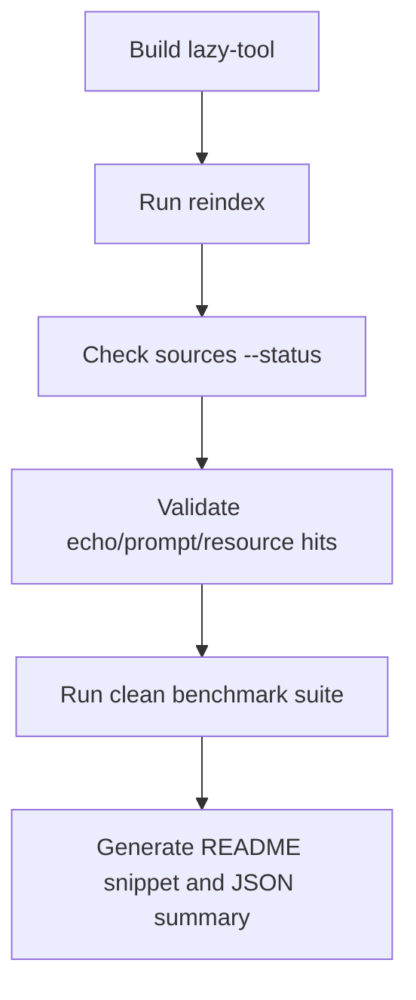

# Benchmarking lazy-tool

## Table of contents

- [What this benchmark is for](#what-this-benchmark-is-for)
- [What the benchmark should prove](#what-the-benchmark-should-prove)
- [What it should not overclaim](#what-it-should-not-overclaim)
- [Environment](#environment)
- [Quick reproducible flow](#quick-reproducible-flow)
- [Recommended README benchmark suite](#recommended-readme-benchmark-suite)
- [Multi-provider benchmark suite](#multi-provider-benchmark-suite)
- [Tasks](#tasks)
- [Current headline snapshot](#current-headline-snapshot)
- [How to publish benchmark results responsibly](#how-to-publish-benchmark-results-responsibly)
- [Output files](#output-files)
- [Weak-model (Ollama) benchmark suite](#weak-model-ollama-benchmark-suite)
- [Troubleshooting](#troubleshooting)

## What this benchmark is for

This benchmark measures how `lazy-tool` behaves compared with direct MCP gateway attachment across multiple modes and providers.

It is mainly useful for answering questions like:

- does `lazy-tool` reduce prompt overhead? (search mode)
- does direct mode add meaningful overhead vs baseline?
- does the smaller MCP surface help on discovery tasks?
- are search and retrieval flows working?
- are routed tool calls (search → invoke) stable enough to publish?

## What the benchmark should prove

The most defensible claims today are:

- **token savings on no-tool turns** (search mode)
- **direct mode overhead** compared to baseline
- **basic search and discovery reliability**
- **prompt and resource retrieval reliability**
- **routed task success** (search → invoke → verify)
- **comparative latency on narrow flows**

## What it should not overclaim

Benchmark output should **not** be used to claim:

- universal tool-use reliability
- all-model compatibility
- production-grade stability across every routed task
- broad superiority on every benchmark scenario

Publishing honest benchmark claims is part of the project's reputation.

## Environment

### Prerequisites

- Go 1.25+ (to build lazy-tool)
- Node.js / npx (for the `everything` and `filesystem` MCP servers)
- Python 3.11+ (for the benchmark harnesses)
- [uv](https://docs.astral.sh/uv/) (recommended, for `mcp-server-time` via `uvx`)
- At least one of: `GROQ_API_KEY`, `ANTHROPIC_API_KEY`, `OPENAI_API_KEY`
- For weak-model benchmarks: [Ollama](https://ollama.com) running locally with at least one model pulled

### Setting up MCPJungle

The benchmarks use [MCPJungle](https://github.com/mcpjungle/MCPJungle) as the upstream MCP gateway that hosts the test tools. Baseline mode connects directly to MCPJungle; search and direct modes connect through lazy-tool which indexes MCPJungle's catalog.

**1. Install MCPJungle:**

```bash
# See https://github.com/mcpjungle/MCPJungle for full install instructions
go install github.com/mcpjungle/mcpjungle@latest
```

**2. Start MCPJungle:**

```bash
mcpjungle serve
# Default: http://127.0.0.1:8080/mcp (strong model suite)
# Or configure a different port and pass --jungle-url to the benchmark scripts
```

**3. Register the sample MCP servers:**

```bash
./benchmark/mcpjungle-dev/register-samples.sh
```

This registers three MCP servers into MCPJungle:

| Server | Transport | What it provides | Requires |
|--------|-----------|-----------------|----------|
| `everything` | stdio | echo tool, prompts, resources (MCP reference server) | npx |
| `filesystem` | stdio | read/write/list tools scoped to `/tmp/lazy-tool-mcpjungle-fs` | npx |
| `time` | stdio | time conversion tools | uvx |

**4. Verify tools are registered:**

```bash
mcpjungle list tools
# Should show tools from everything, filesystem, and time servers
```

### Python dependencies

Requires Python 3.11+. Install with [uv](https://docs.astral.sh/uv/) (recommended) or pip:

```bash
# using uv
uv pip install --python benchmark/.venv/bin/python -r benchmark/requirements.txt

# or using pip
pip install -r benchmark/requirements.txt
```

### Weak-model setup (Ollama)

```bash
# Install Ollama: https://ollama.com
ollama serve                    # start the server
ollama pull qwen2.5:3b          # pull at least one model
```

## Quick reproducible flow

### 1. Build and reindex

```bash
make build
export LAZY_TOOL_CONFIG=$PWD/benchmark/configs/mcpjungle-lazy-tool.yaml
./bin/lazy-tool reindex
./bin/lazy-tool sources --status
```

### 2. Sanity-check the catalog

```bash
./bin/lazy-tool search "echo" --limit 10
./bin/lazy-tool search "prompt" --limit 10
./bin/lazy-tool search "resource" --limit 10
```

### 3. Run the clean README suite

```bash
./benchmark/run_readme_benchmark_suite.sh --model llama-3.1-8b-instant --repeat 20
```

## Recommended README benchmark suite



For README-level claims, prefer the **clean suite**:

- `no_tool` (both)
- `search_tools_smoke` (lazy)
- `search_tools_prompt` (lazy)
- `search_tools_resource` (lazy)

Optional:
- `ambiguous_search` only if the success rate is respectable
- `everything_echo` only if the lazy routed path is stable enough to publish

Do **not** use filesystem tasks as README headline evidence unless they are known-good and intentionally part of the public benchmark story.

## Multi-provider benchmark suite

The multi-provider suite (`run_multi_provider_benchmark.py`) extends the original Groq-only harness to support Groq, Anthropic, and OpenAI providers across three benchmark modes. Only Groq has been benchmarked so far — the harness is ready for other providers when API keys are available.

| Mode | Description | Tool surface |
|---|---|---|
| **baseline** | Direct MCP via MCPJungle (no lazy-tool) | All upstream tools |
| **search** | lazy-tool's 5 meta-tools via stdio | search_tools → invoke_proxy_tool |
| **direct** | lazy-tool as transparent aggregator via stdio | All cataloged tools proxied |

### Running

```bash
# Single provider, all modes
python benchmark/run_multi_provider_benchmark.py \
  --provider anthropic --model claude-sonnet-4-20250514 --mode all --repeat 5

# Specific tasks only
python benchmark/run_multi_provider_benchmark.py \
  --provider openai --tasks routed_echo,routed_file_read --mode all

# Full automated suite (auto-detects API keys)
./benchmark/run_strong_model_suite.sh --repeat 10

# Output to files
python benchmark/run_multi_provider_benchmark.py \
  --provider groq --mode all \
  --jsonl-out results.jsonl --csv-out results.csv
```

### New routed tasks

| Task | Modes | What it tests |
|---|---|---|
| `routed_echo` | baseline, search, direct | Search → invoke echo → verify output |
| `routed_file_read` | baseline, search, direct | Search → read file → verify content |
| `routed_prompt` | baseline, search, direct | Search → get prompt → verify response |

Routed tasks use per-mode prompts: search mode instructs the agent to use `search_tools` then `invoke_proxy_tool`, while direct mode simply asks to call the tool by name.

### Validation

```bash
# Validate golden data
python benchmark/scripts/validate_multi_provider_jsonl.py benchmark/golden/multi_provider_sample_rows.jsonl

# Run unit tests (no API keys needed)
python benchmark/scripts/test_multi_provider_harness.py -v
```

---

## Weak-model (Ollama) benchmark suite

The weak-model suite (`run_weak_model_benchmark.py`) tests local models via Ollama to measure whether the search-first approach helps small models use MCP tools — specifically in the local, single-binary setup that lazy-tool provides.

### Three tiers

| Tier | What it tests | LLM needed? |
|------|--------------|-------------|
| **1** | Basic tool-calling ability | Yes |
| **2** | Search surface navigation (coached vs natural) | Yes |
| **3** | Deterministic search quality (precision@1, precision@3) | No |

### Tasks

| Task | Tier | Modes | Style | What it tests |
|------|------|-------|-------|---------------|
| `single_tool_call` | 1 | direct | Coached | Can the model do structured tool calling at all? |
| `format_compliance` | 1 | direct | Coached | Does the model use the API or fake it in text? |
| `search_coached` | 2 | search | Coached | Can it call search_tools when told exactly how? |
| `search_natural` | 2 | search | Natural | Can it figure out to use search_tools on its own? |
| `search_invoke_coached` | 2 | search, direct, baseline | Coached | Full search-then-invoke with hand-holding |
| `search_invoke_natural` | 2 | search, direct, baseline | Natural | Full flow without coaching — the real test |
| `search_precision` | 3 | search | N/A | Deterministic search quality measurement |

### Running

```bash
# Single model, specific mode
python benchmark/run_weak_model_benchmark.py --model qwen2.5:3b --mode search --repeat 3

# Specific tiers only
python benchmark/run_weak_model_benchmark.py --model llama3.2:3b --mode all --tier 1,2

# Tier 3 only (deterministic, no Ollama needed)
python benchmark/run_weak_model_benchmark.py --tier 3

# All default models
python benchmark/run_weak_model_benchmark.py --all-models --mode all

# Full automated suite (auto-discovers installed Ollama models)
./benchmark/run_weak_model_suite.sh --repeat 3
./benchmark/run_weak_model_suite.sh --models qwen2.5:3b --repeat 2
```

### Validation

```bash
# Validate golden data
python benchmark/scripts/validate_weak_model_jsonl.py benchmark/golden/weak_model_sample_rows.jsonl

# Semantic invariant checks
python benchmark/scripts/check_weak_model_golden_invariants.py benchmark/golden/weak_model_sample_rows.jsonl

# Run unit tests (no Ollama needed)
python benchmark/scripts/test_weak_model_harness.py -v
```

### Output structure

```
benchmark-results/weak-YYYYMMDD-HHMMSS/
  manifest.json           # timestamp, models_tested, ollama_version
  raw/
    search_quality.jsonl   # Tier 3 (model-independent)
    qwen2.5-3b.jsonl       # Tier 1+2 per model
    llama3.2-3b.jsonl
  combined.jsonl
```

---

## Tasks

### `no_tool`
Best headline benchmark for token savings and latency.

### `search_tools_smoke`
Best basic proof that the discovery surface works.

### `search_tools_prompt`
Useful for prompt-catalog retrieval quality.

### `search_tools_resource`
Useful for resource-catalog retrieval quality.

### `ambiguous_search`
Good stress case for overloaded names, but publish carefully.

### `everything_echo`
Useful routed-tool benchmark, but only publish if lazy-mode wrapper and tool selection is stable.

## Current headline snapshot

**Date:** 2026-03-29  
**Model:** `llama-3.1-8b-instant`  
**Repeats:** 20

### Baseline no-tool comparison

| Scenario | Avg input tokens | Avg latency |
|---|---:|---:|
| Direct MCP gateway | 1701 | 0.232s |
| `lazy-tool` stdio | 915 | 0.158s |

**Headline result**
- **46.2% lower input tokens**
- **31.9% lower average latency**

### Search and discovery reliability snapshot

| Task | Success rate |
|---|---:|
| `search_tools_smoke` | 20/20 |
| `search_tools_resource` | 18/20 |
| `search_tools_prompt` | 16/20 |
| `ambiguous_search` | 6/20 |

Interpretation:
- smoke and resource retrieval are already useful
- prompt retrieval is decent but not perfect
- ambiguous retrieval still needs work
- routed tool invocation should be published cautiously

## How to publish benchmark results responsibly

When you publish benchmark results, always record:

- benchmark date
- repo commit
- model used
- repeat count
- which tasks were included
- whether the run was a README-clean suite or a broader experimental suite

Do not mix experimental or flaky tasks into headline claims.

## Output files

Typical benchmark artifacts include:

- raw JSONL rows
- CSV exports
- benchmark manifest
- README snippet
- JSON summary

Keep raw artifacts around when updating public benchmark claims.

## Troubleshooting

### `search_tools_smoke` returns zero hits

Usually:
- MCPJungle is not running or sample MCPs are not registered (see [Setting up MCPJungle](#setting-up-mcpjungle))
- you forgot `reindex`
- your source config is wrong
- the indexed catalog is stale or empty

Verify with:
```bash
export LAZY_TOOL_CONFIG=$PWD/benchmark/configs/mcpjungle-lazy-tool.yaml
./bin/lazy-tool reindex
./bin/lazy-tool search "echo" --limit 5
```

### routed task chooses the wrong wrapper

This is usually:
- model behavior
- task wording not being strict enough
- lazy wrapper selection not yet strong enough for that scenario

### `serve` exits with EOF-style noise

That is often expected stdio shutdown behavior and should be handled separately from real benchmark failures.
