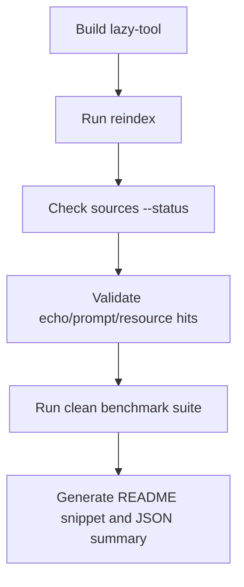

# Benchmarking lazy-tool

## Table of contents

- [What this benchmark is for](#what-this-benchmark-is-for)
- [What the benchmark should prove](#what-the-benchmark-should-prove)
- [What it should not overclaim](#what-it-should-not-overclaim)
- [Environment](#environment)
- [Quick reproducible flow](#quick-reproducible-flow)
- [Recommended README benchmark suite](#recommended-readme-benchmark-suite)
- [Tasks](#tasks)
- [Current headline snapshot](#current-headline-snapshot)
- [How to publish benchmark results responsibly](#how-to-publish-benchmark-results-responsibly)
- [Output files](#output-files)
- [Troubleshooting](#troubleshooting)

## What this benchmark is for

This benchmark measures how `lazy-tool` behaves compared with direct MCP gateway attachment.

It is mainly useful for answering questions like:

- does `lazy-tool` reduce prompt overhead?
- does the smaller MCP surface help on discovery tasks?
- are search and retrieval flows working?
- are routed tool calls stable enough to publish?

## What the benchmark should prove

The most defensible claims today are:

- **token savings on no-tool turns**
- **basic search and discovery reliability**
- **prompt and resource retrieval reliability**
- **comparative latency on narrow flows**

## What it should not overclaim

Benchmark output should **not** be used to claim:

- universal tool-use reliability
- all-model compatibility
- production-grade stability across every routed task
- broad superiority on every benchmark scenario

Publishing honest benchmark claims is part of the project's reputation.

## Environment

Recommended local environment:

- MCPJungle running locally
- sample local MCPs registered
- `lazy-tool` built from the repo root
- valid `benchmark/configs/mcpjungle-lazy-tool.yaml`
- `GROQ_API_KEY` exported

## Quick reproducible flow

### 1. Build and reindex

```bash
make build
export LAZY_TOOL_CONFIG=$PWD/benchmark/configs/mcpjungle-lazy-tool.yaml
./bin/lazy-tool reindex
./bin/lazy-tool sources --status
```

### 2. Sanity-check the catalog

```bash
./bin/lazy-tool search "echo" --limit 10
./bin/lazy-tool search "prompt" --limit 10
./bin/lazy-tool search "resource" --limit 10
```

### 3. Run the clean README suite

```bash
./run_readme_benchmark_suite.sh --model llama-3.1-8b-instant --repeat 20
```

## Recommended README benchmark suite



For README-level claims, prefer the **clean suite**:

- `no_tool` (both)
- `search_tools_smoke` (lazy)
- `search_tools_prompt` (lazy)
- `search_tools_resource` (lazy)

Optional:
- `ambiguous_search` only if the success rate is respectable
- `everything_echo` only if the lazy routed path is stable enough to publish

Do **not** use filesystem tasks as README headline evidence unless they are known-good and intentionally part of the public benchmark story.

## Tasks

### `no_tool`
Best headline benchmark for token savings and latency.

### `search_tools_smoke`
Best basic proof that the discovery surface works.

### `search_tools_prompt`
Useful for prompt-catalog retrieval quality.

### `search_tools_resource`
Useful for resource-catalog retrieval quality.

### `ambiguous_search`
Good stress case for overloaded names, but publish carefully.

### `everything_echo`
Useful routed-tool benchmark, but only publish if lazy-mode wrapper and tool selection is stable.

## Current headline snapshot

**Date:** 2026-03-29  
**Model:** `llama-3.1-8b-instant`  
**Repeats:** 20

### Baseline no-tool comparison

| Scenario | Avg input tokens | Avg latency |
|---|---:|---:|
| Direct MCP gateway | 1701 | 0.232s |
| `lazy-tool` stdio | 915 | 0.158s |

**Headline result**
- **46.2% lower input tokens**
- **31.9% lower average latency**

### Search and discovery reliability snapshot

| Task | Success rate |
|---|---:|
| `search_tools_smoke` | 20/20 |
| `search_tools_resource` | 18/20 |
| `search_tools_prompt` | 16/20 |
| `ambiguous_search` | 6/20 |

Interpretation:
- smoke and resource retrieval are already useful
- prompt retrieval is decent but not perfect
- ambiguous retrieval still needs work
- routed tool invocation should be published cautiously

## How to publish benchmark results responsibly

When you publish benchmark results, always record:

- benchmark date
- repo commit
- model used
- repeat count
- which tasks were included
- whether the run was a README-clean suite or a broader experimental suite

Do not mix experimental or flaky tasks into headline claims.

## Output files

Typical benchmark artifacts include:

- raw JSONL rows
- CSV exports
- benchmark manifest
- README snippet
- JSON summary

Keep raw artifacts around when updating public benchmark claims.

## Troubleshooting

### `search_tools_smoke` returns zero hits

Usually:
- you forgot `reindex`
- your source config is wrong
- the indexed catalog is stale or empty

### routed task chooses the wrong wrapper

This is usually:
- model behavior
- task wording not being strict enough
- lazy wrapper selection not yet strong enough for that scenario

### `serve` exits with EOF-style noise

That is often expected stdio shutdown behavior and should be handled separately from real benchmark failures.
