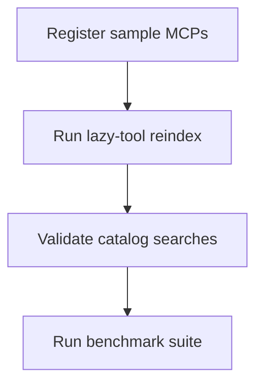

# MCPJungle local dev helpers

## Table of contents

- [What this folder is for](#what-this-folder-is-for)
- [Register sample servers](#register-sample-servers)
- [Recommended flow](#recommended-flow)
- [Troubleshooting](#troubleshooting)

## What this folder is for

This folder contains local helper files for running the benchmark environment with MCPJungle.

Use it when you want a reproducible local setup for:

- `lazy-tool reindex`
- discovery and search validation
- benchmark runs against a merged local MCP gateway

For the main benchmark methodology, see [../README.md](../README.md).

## Register sample servers

Use the included helper script:

```bash
cd benchmark/mcpjungle-dev
chmod +x register-samples.sh
./register-samples.sh
```

If your environment differs, edit the JSON configs in this folder first.

## Recommended flow



### 1. Register the sample MCPs

```bash
cd benchmark/mcpjungle-dev
./register-samples.sh
```

### 2. Reindex lazy-tool

```bash
export LAZY_TOOL_CONFIG=$PWD/../configs/mcpjungle-lazy-tool.yaml
cd ../.. && make build && ./bin/lazy-tool reindex
```

### 3. Validate search

```bash
./bin/lazy-tool search "echo" --limit 10
./bin/lazy-tool search "prompt" --limit 10
./bin/lazy-tool search "resource" --limit 10
```

## Troubleshooting

### `mcpjungle register` fails

Make sure you are using the JSON config files and not an empty command invocation.

### lazy-tool search returns nothing

Usually:
- sample MCPs were not registered
- `reindex` was skipped
- the benchmark config points at the wrong MCPJungle URL
