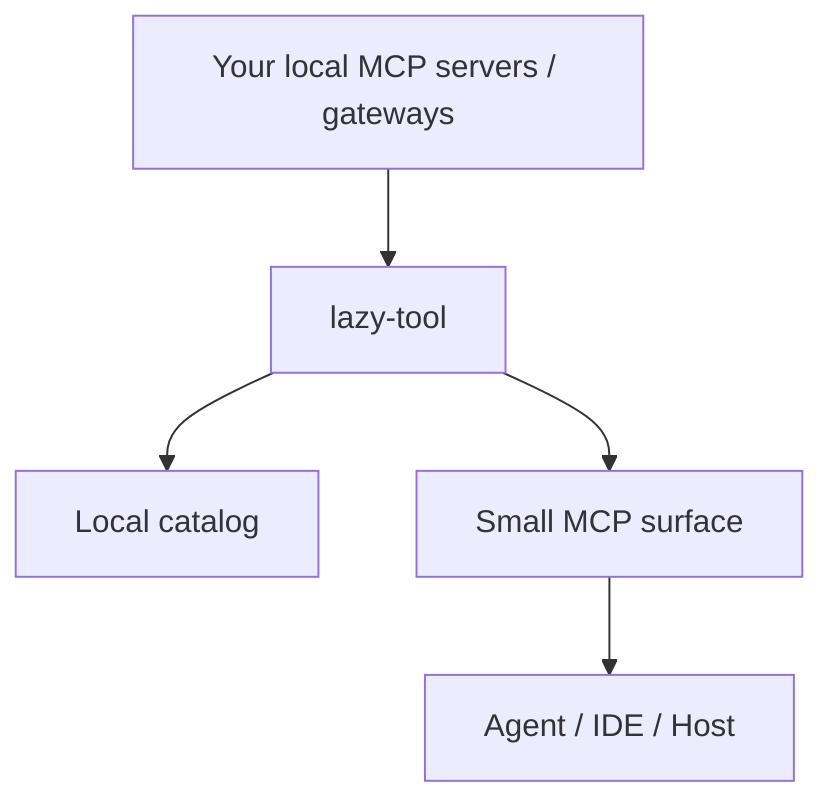

# Plugging in MCPs you already run

## Table of contents

- [What this doc covers](#what-this-doc-covers)
- [Mental model](#mental-model)
- [Compatibility rules](#compatibility-rules)
- [Pattern A: local HTTP MCP](#pattern-a-local-http-mcp)
- [Pattern B: local stdio MCP](#pattern-b-local-stdio-mcp)
- [Pattern C: mixed local sources](#pattern-c-mixed-local-sources)
- [After changing sources](#after-changing-sources)
- [Troubleshooting](#troubleshooting)

## What this doc covers

This page explains how to point `lazy-tool` at MCP servers or gateways you already run locally.

You do **not** need to replace your current setup.

You only need to:
- add `lazy-tool` as its own local process
- declare where your existing MCP sources live under `sources:`
- reindex the catalog

## Mental model



`lazy-tool` does not auto-discover random processes on your machine.

Instead, you declare local sources explicitly:

- HTTP MCP endpoint → `transport: http`
- stdio MCP server → `transport: stdio`

`lazy-tool` then:
- connects for indexing
- stores a local capability catalog
- proxies the real upstream call only after capability selection

## Compatibility rules

### HTTP sources

HTTP sources must expose **MCP streamable HTTP** at the configured URL.

If the endpoint is:
- SSE-only
- not MCP-compatible
- or an old wrapper with a different wire shape

`reindex` will fail.

### Stdio sources

Stdio sources are executed by `lazy-tool` as child processes.

Important details:
- use `command` and `args`
- use `cwd` if the process expects a specific working directory
- the child process inherits `lazy-tool`'s environment
- use wrapper scripts if your setup needs custom env shaping

## Pattern A: local HTTP MCP

```yaml
sources:
  - id: my-http-source
    type: gateway
    transport: http
    url: http://127.0.0.1:8811/mcp
```

Use this when you already have a local MCP gateway or HTTP MCP server running.

## Pattern B: local stdio MCP

```yaml
sources:
  - id: my-stdio-source
    type: server
    transport: stdio
    command: npx
    args: ["-y", "@someorg/some-server"]
    cwd: /absolute/path/to/project
```

Use this when the source is normally launched as a local process.

## Pattern C: mixed local sources

```yaml
sources:
  - id: local-gateway
    type: gateway
    transport: http
    url: http://127.0.0.1:3000/mcp

  - id: local-stdio
    type: server
    transport: stdio
    command: /opt/bin/my-mcp
    args: ["--config", "/path/to/config.yaml"]
    cwd: /absolute/path/to/project
```

This is the common real local dev machine setup.

## After changing sources

Always reindex after changing `sources:`.

```bash
export LAZY_TOOL_CONFIG=$PWD/configs/example.yaml
./bin/lazy-tool reindex
./bin/lazy-tool sources --status
```

Then validate with:

```bash
./bin/lazy-tool search "echo" --limit 10
./bin/lazy-tool search "prompt" --limit 10
./bin/lazy-tool search "resource" --limit 10
```

## Troubleshooting

### `reindex` fails

Check:
- source URL correctness
- MCP wire compatibility
- `cwd` correctness for stdio
- whether the process runs successfully outside `lazy-tool`

### search returns zero hits

Usually check these first:
- did you run `reindex`?
- does `sources --status` show a healthy source?
- are you searching for something actually present in the indexed catalog?

### stdio source behaves differently from IDE setup

Usually the cause is:
- working directory mismatch
- missing environment variables
- different wrapper or launch command

Use `cwd`, absolute paths, or a wrapper script.
